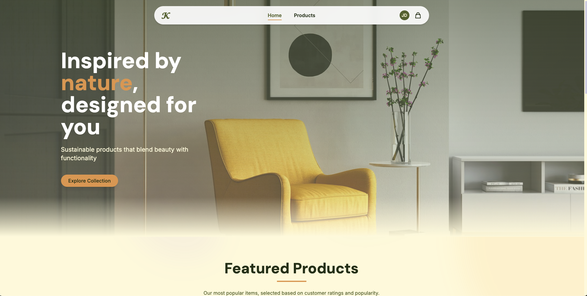
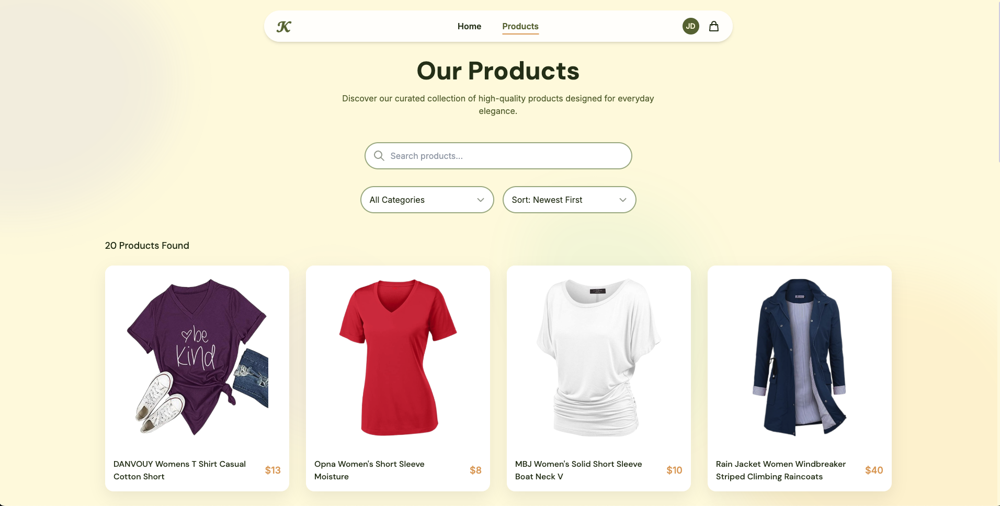
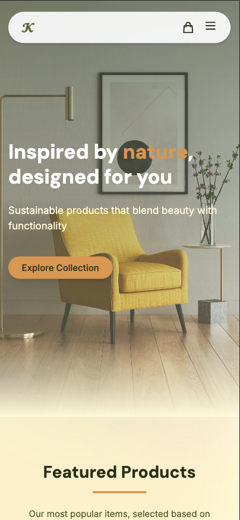
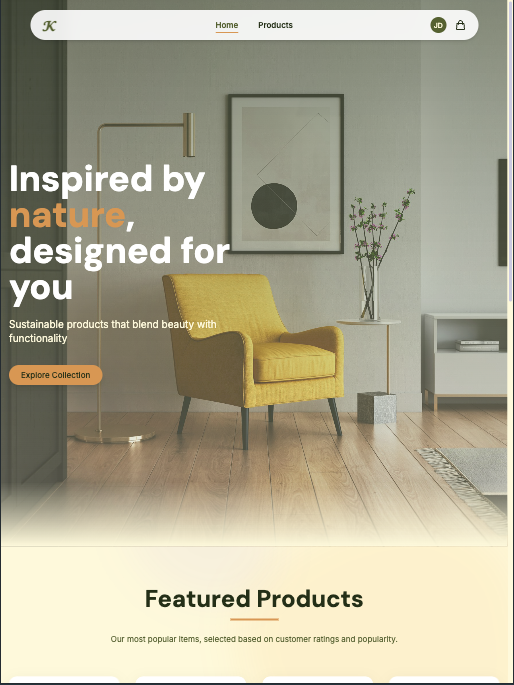

# Kota Store - Modern E-Commerce Application

## 🚀 Live Demo

**Frontend using backend:** [https://kota-web-cxx.vercel.app/](https://kota-web-cxx.vercel.app/)  
<br>

**API:** [https://kota-api-cxx.onrender.com/](https://kota-api-cxx.onrender.com/)

A modern e-commerce application built with Next.js, featuring a responsive design, seamless cart management, and user authentication. This application demonstrates a complete MCP (Model-Context-Protocol) architecture by integrating with the FakeStore API.

## 🌟 Features

- **User Authentication** - Secure login system with JWT session management
- **Product Browsing** - Browse products with filtering capabilities
- **Product Details** - View detailed product information with image zoom
- **Shopping Cart** - Add, remove, and update items in your cart
- **Responsive Design** - Optimized for desktop, tablet, and mobile devices
- **Advanced UI Features**:
  - Image magnification on hover
  - Animated components
  - Smooth transitions
  - "Back to top" functionality
  - Product recommendations

## 🖥️ Screenshot (Desktop)


## 🖥️ Screenshot (Mobile & Tablet)


## 🛠️ Technology Stack

- **Frontend:**
  - Next.js 14 (App Router)
  - React 18
  - TailwindCSS
  - Framer Motion
  - React Context API

- **Backend:**
  - Express.js
  - Node.js
  - FakeStore API integration

- **Deployment:**
  - Frontend: Vercel
  - Backend: Render

- **Tools:**
  - NX Monorepo
  - Docker
  - ESLint & Prettier

## 📂 Project Structure

```
kota/
├── apps/
│   ├── kota-api/        # Express API server (MCP implementation)
│   │   ├── src/         # API source code
│   │   └── Dockerfile   # Container configuration
│   │
│   └── kota-web/        # Next.js frontend
│       ├── src/         # Frontend source code
│       └── public/      # Static assets
│
└── package.json         # Root package configuration
```

## 🔧 Quick Start

### Prerequisites

- Node.js (v18 or higher)
- npm or yarn
- Docker (optional)

### Local Development

1. Clone the repository:
```bash
git clone https://github.com/aravindasiva/kota.git
cd kota
```

2. Install dependencies:
```bash
npm install
```

3. Start the development servers:
```bash
# Start API server
cd apps/kota-api
npm run dev

# Start web application (in another terminal)
cd apps/kota-web
npm run dev
```

4. Access the applications:
   - Frontend: [http://localhost:3000](http://localhost:3000)
   - API: [http://localhost:3001](http://localhost:3001)

### Using Docker

```bash
# Build and run the API container
docker build -t kota-api -f apps/kota-api/Dockerfile .
docker run -p 3001:10000 -e PORT=10000 kota-api
```

## 🌐 API Integration

This application uses a custom MCP server implementation to connect with the FakeStore API.

### Core Endpoints

| Endpoint | Method | Description |
|----------|--------|-------------|
| `/products` | GET | Get all products |
| `/products/:id` | GET | Get product details |
| `/auth/login` | POST | User login |
| `/carts/user/:id` | GET | Get user's cart |
| `/carts` | POST | Add item to cart |
| `/carts/:id/product/:id` | DELETE | Remove item from cart |

## 📱 Responsive Design

The application is fully responsive and provides an optimal viewing experience across all device sizes:

- Desktop (1024px and above)
- Tablet (768px to 1023px)
- Mobile (below 768px)

## 🔒 Authentication

Test the application with these credentials:

- Username: `johnd`
- Password: `m38rmF$`

## 📞 Contact

Aravinda Siva - [GitHub](https://github.com/aravindasiva)

Project Link: [https://github.com/aravindasiva/kota](https://github.com/aravindasiva/kota)

---

Made with ❤️ by aravindasiva
